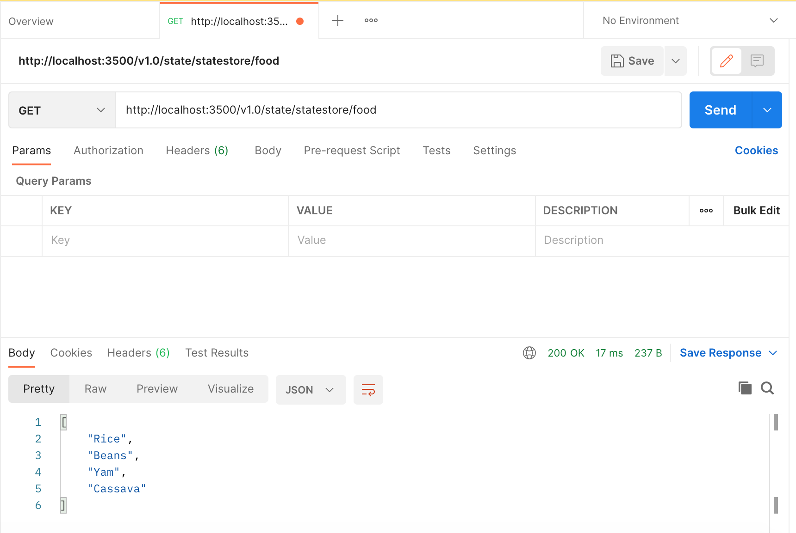

# Dapr state management 

### make sure to have Docker running on your machine 

### setup dapr on your machine through this [guide](https://docs.dapr.io/getting-started/install-dapr-cli/)

- initialize dapr and allow it to config with the docker in your machine by running the command

``` dapr init ```
- Verify Dapr version run the command

``` dapr --version ```

Verify containers are running the dapr instance run command

``` docker ps ```

- Expected output 
```
CONTAINER ID   IMAGE                    COMMAND                  CREATED         STATUS         PORTS                              NAMES
0dda6684dc2e   openzipkin/zipkin        "/busybox/sh run.sh"     2 minutes ago   Up 2 minutes   9410/tcp, 0.0.0.0:9411->9411/tcp   dapr_zipkin
9bf6ef339f50   redis                    "docker-entrypoint.s…"   2 minutes ago   Up 2 minutes   0.0.0.0:6379->6379/tcp             dapr_redis
8d993e514150   daprio/dapr              "./placement"            2 minutes ago   Up 2 minutes   0.0.0.0:6050->50005/tcp            dapr_placement

```

### Run the Dapr sidecar 

``` dapr run --app-id myapp --dapr-http-port 3500 ```

- to start the program run command

``` python3 post.py ```


- send a get request to retrieve data from dapr store run command

``` python3 get.py ```
### OR
